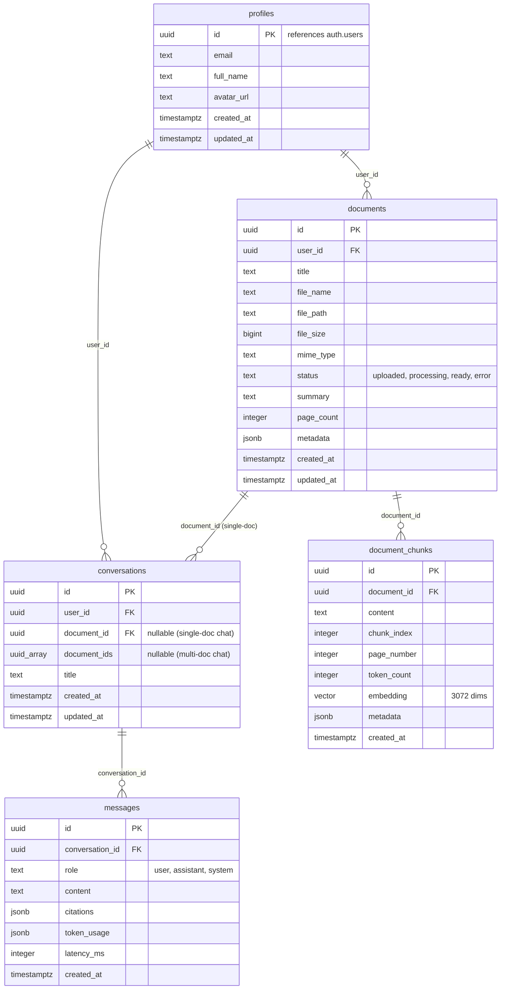

# Entity-Relationship Diagram

This diagram represents the main tables in the Research AI database schema.

> Source of truth: kept in sync with `src/types/database.ts` and
> `supabase/migrations/`. If code and this doc disagree, the code wins.
> Regenerate types after any schema change: `npm run db:types`.

## Notes

- **Single-doc vs multi-doc chat.** A `conversation` links to a document one of
  two ways: `document_id` (a single document, real FK) or `document_ids uuid[]`
  (multiple documents, added by the multi-document chat migration). `document_id`
  is nullable — a multi-doc conversation may leave it null and populate
  `document_ids` instead. The array column has no FK constraint, so document
  deletes are not cascaded through it.
- **Vector search.** `document_chunks.embedding` is `vector(3072)`
  (`gemini-embedding-001`). Similarity search runs through the
  `match_document_chunks` (single-doc) and `match_multiple_document_chunks`
  (multi-doc) SQL functions using cosine distance (`<=>`). No ANN index is
  defined on the column — see `docs/ARCHITECTURE.md`, Stage 4.
- **RLS.** Every table is user-scoped via Row Level Security; `profiles.id`
  is a 1:1 reference to `auth.users`, auto-created on signup by the
  `handle_new_user()` trigger.
- **Multi-doc migration:** `supabase/migrations/20260611_multi_document_chat.sql`
  adds `conversations.document_ids` and drops the `NOT NULL` on `document_id`.
