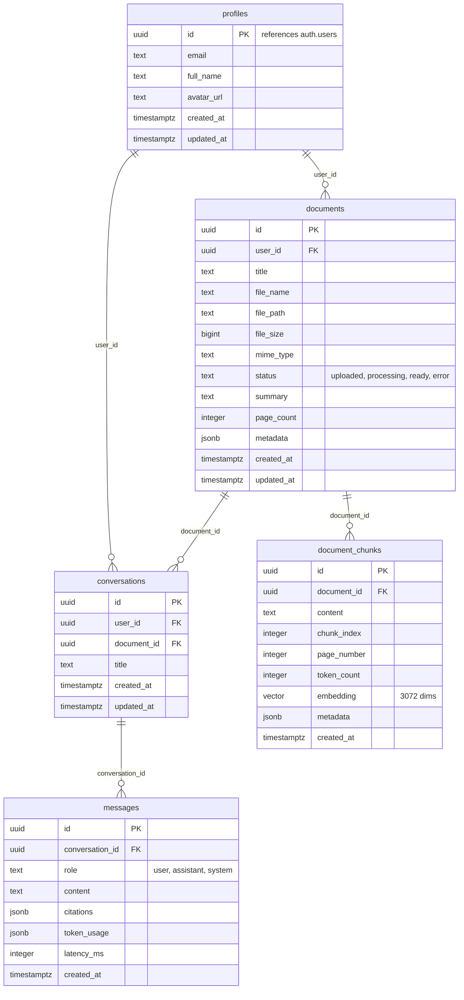

# Entity-Relationship Diagram

This diagram represents the main tables in the Research AI database schema.

```mermaid
erDiagram
    profiles ||--o{ documents : "user_id"
    profiles ||--o{ conversations : "user_id"
    documents ||--o{ document_chunks : "document_id"
    documents ||--o{ conversations : "document_id"
    conversations ||--o{ messages : "conversation_id"

    profiles {
        uuid id PK "references auth.users"
        text email
        text full_name
        text avatar_url
        timestamptz created_at
        timestamptz updated_at
    }

    documents {
        uuid id PK
        uuid user_id FK
        text title
        text file_name
        text file_path
        bigint file_size
        text mime_type
        text status "uploaded, processing, ready, error"
        text summary
        integer page_count
        jsonb metadata
        timestamptz created_at
        timestamptz updated_at
    }

    document_chunks {
        uuid id PK
        uuid document_id FK
        text content
        integer chunk_index
        integer page_number
        integer token_count
        vector embedding "3072 dims"
        jsonb metadata
        timestamptz created_at
    }

    conversations {
        uuid id PK
        uuid user_id FK
        uuid document_id FK
        text title
        timestamptz created_at
        timestamptz updated_at
    }

    messages {
        uuid id PK
        uuid conversation_id FK
        text role "user, assistant, system"
        text content
        jsonb citations
        jsonb token_usage
        integer latency_ms
        timestamptz created_at
    }
```
